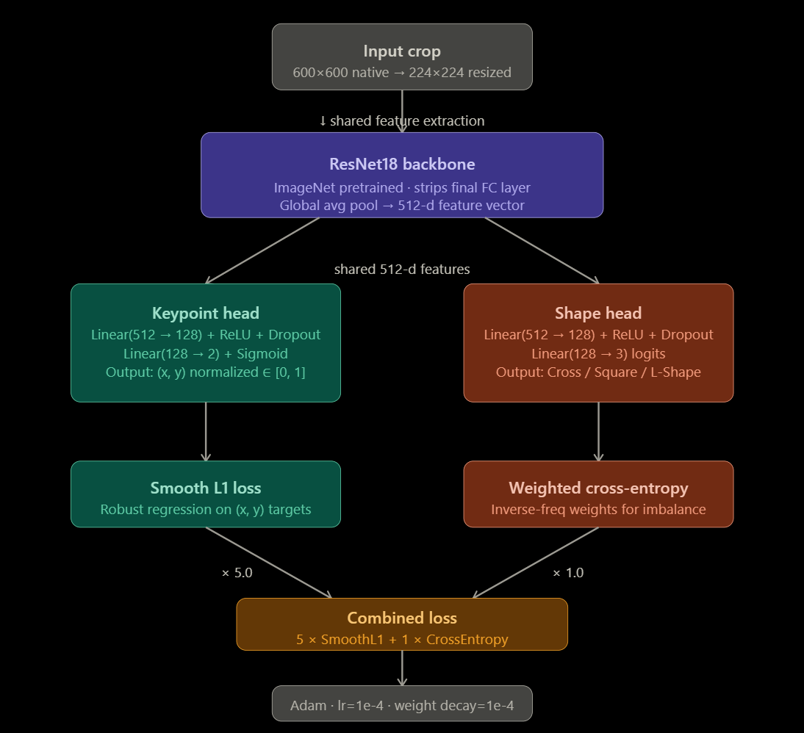

# gcp-pose-estimation

## Network architecture choice and rationale

A shared ResNet backbone is used for both tasks: keypoint regression and shape classification. The default model is `ResNet18` with ImageNet-pretrained weights for a practical baseline that trains quickly and keeps deployment simple. A shared CNN trunk is followed by two small task-specific heads:

- regression head: outputs 2 normalized coordinates in [0, 1] via a Sigmoid activation
- classification head: outputs 3 logits for `Cross`, `Square`, and `L-Shape`

This design is parameter-efficient, avoids duplicate feature extraction, and is a good fit for the assignment’s focus on robust, practical solutions.

## Training strategy

- Input: 600×600 native-image crops centered on each GCP marker, resized to 224×224.
- Augmentation: random crop-center jitter during training plus photometric augmentation using `ColorJitter` (brightness, contrast, saturation, hue) to improve robustness.
- Normalization: ImageNet mean/std normalization on image tensors and target keypoints normalized to [0, 1] in model-input space.
- Split strategy: group-aware train/val split by `project/survey/gcp_id`, preventing leakage from multiple images of the same physical marker.
- Loss: combined objective with Smooth L1 for keypoint regression and weighted cross-entropy for shape classification.
- Class weighting: inverse-frequency weights compensate for class imbalance and support macro-F1 evaluation.
- Optimization: Adam with a small learning rate, weight decay, and early stopping to prevent overfitting.

## Dataset challenges and mitigations

- Malformed label entries and missing image files were filtered out before training.
- Some crop windows extend beyond image borders; this is handled by PIL’s `Image.crop()` auto-padding behavior, so invalid crop logic is avoided.
- Marker shape classes are imbalanced, so classification uses class-balanced weights.
- Multiple correlated images share the same marker group, so validation is split at the group level to avoid leakage.
- Regression targets are normalized to stabilize scale and balance them with classification loss.

## Key implementation notes

- `src/model.py` defines the shared backbone and dual-head architecture.
- `src/dataset.py` handles crop extraction, augmentation, resizing, and normalized target generation.
- `src/losses.py` combines `SmoothL1Loss` for keypoints with `CrossEntropyLoss` for shape prediction.
- `configs/config.yaml` contains the default training, model, and inference settings.

